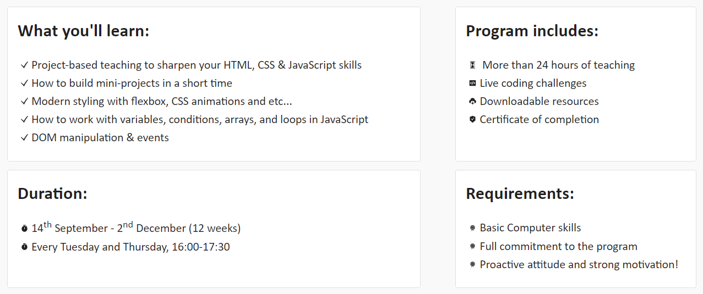

<h2 align="center">
   
  Welcome to coding101 - Web Development Essentials 2021!
  
</h2>

Our training program “Coding 101 - Web Development Essentials” teaches you in 12 weeks the three basic coding languages - HTML, CSS and JavaScript. You don’t need any previous coding experience but you need to be able to commit to the full 12 weeks of training.
At the end of the course, you will have the chance to use the skills you learned in a project and successful participants will receive a certificate.
After completing the course you will be able to build a website or homepage and perform any tasks associated with developing websites for hosting via intranet or internet.

<i>Happy Coding!</i> 😊

